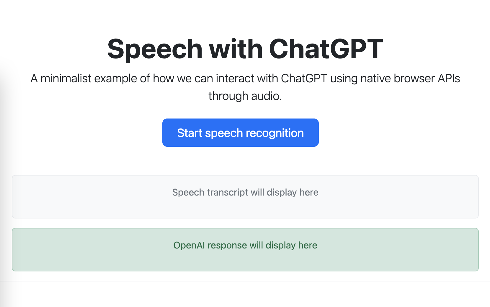

# Speech with ChatGPT

This is an example of a web page that uses the speech recognition API and the OpenAI API to turn speech into text and then send it to the OpenAI API to generate a response. The response is then read out loud by the browser.

## Requirements

- OpenAI API Key

## How to use

1. Clone the repository or download the HTML file
2. Replace "API_KEY" with your own API key
3. Open the HTML file in a browser that supports the speech recognition API (such as Google Chrome)
4. Click the "Start speech recognition" button and say something
5. The OpenAI API response will be displayed on the screen and read out loud by the browser

## Previsualization

Video: [Youtube Video](https://www.youtube.com/watch?v=rYf4SS7EnPU)

## Considerations

- Make sure your browser supports the speech recognition API
- The response text may be different each time, depending on the OpenAI API
- The voice used to read the response can be changed, just find the desired voice in the list of available voices in your browser and set the "voice" property of the SpeechSynthesisUtterance class.
